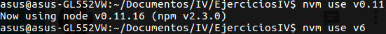

# Ejercicios del tema 2: Desarrollo basado en pruebas
### Ejercicio 1
**Instalar alguno de los entornos virtuales de node.js (o de cualquier otro lenguaje con el que se esté familiarizado) y, con ellos, instalar la última versión existente, la versión minor más actual de la 4.x y lo mismo para la 0.11 o alguna impar (de desarrollo).**

Instalamos nvm mediante:
```bash
curl -o- https://raw.githubusercontent.com/creationix/nvm/v0.32.0/install.sh | bash
```
Tras reiniciar el terminal, comprobamos que nvm se ha instalado correctametne mediante:
```bash
command -v nvm
```
Instalamos la última versión:
```bash
nvm install node
######################################################################## 100,0%
Computing checksum with sha256sum
Checksums matched!
Now using node v6.8.1 (npm v3.10.8)
Creating default alias: default -> node (-> v6.8.1)
```
De igual forma se instala la versión de desarrollo:
```bash
nvm install v0.11
######################################################################## 100,0%
Computing checksum with sha256sum
Checksums matched!
Now using node v0.11.16 (npm v2.3.0)
```
Para hacer el cambio entre versiones se usa el comando _nvm use version-a-usar_ como por ejemplo:
```bash
nvm use v6.8.1
```



### Ejercicio 2
**Como ejercicio, algo ligeramente diferente: una web para calificar las empresas en las que hacen prácticas los alumnos.
Crear un repositorio en GitHub para la librería y crear un pequeño programa que use algunas de sus funcionalidades.
Si se quiere hacer con cualquier otra aplicación, también es válido. Se trata de hacer una aplicación simple que se pueda hacer rápidamente con un generador de aplicaciones como los que incluyen diferentes marcos MVC. Si cuesta mucho trabajo, simplemente prepara una aplicación que puedas usar más adelante en el resto de los ejercicios.**

Voy a seguir un tutorial de node.js, express y jquery del [blog Koalite](http://blog.koalite.com/2011/11/tutorial-node-js-express-jquery-i-creando-la-aplicacion/).

Los pasos que he tenido que seguir que no aparecen en el tutorial son los siguientes:
* Tras la instalación de express, para obtener el generador usar:
```bash
npm install express-generator
```
* Una vez creado el proyecto express, ejecutar el siguiente comando para instalar las dependencias necesarias antes de lanzar la aplicación:
```bash
cd . && npm install
```
* La primera línea del archivo _index.jade_ debe ser _doctype html_ en lugar de _doctype 5_.

A punto de terminal el tutorial, las incongruencias entre el código autogenerado por express 4 y el de ejemplo del tutorial (que se basa en la versión 3) han hecho casi imposible finalizarlo, por lo que he hecho un fork y rehecho los pasos anteriores. [Enlace al repositorio](https://github.com/juanjetomas/Nodejs-Sample)

Ejecutamos la aplicación:


Y en http://localhost:3000/ encontramos:


### Ejercicio 3
**Ejecutar el programa en diferentes versiones del lenguaje. ¿Funciona en todas ellas?**


Tal y como se ve en las 2 imágenes anteriores el programa funciona tanto en la versión v.6.8.1 como en la v0.11.16.

### Ejercicio 4
**Crear una descripción del módulo usando package.json.**
He generado el package.json mediante el comando:
```bash
npm init
```
Obteniendo como resultado:
```javascript
{
  "name": "calificador-empresas-node",
  "version": "1.0.0",
  "description": "Permite la calificacion de empresas de practicas icaro",
  "main": "app.js",
  "dependencies": {
    "express": "^3.0.0rc3",
    "jade": "^0.27.2",
    "underscore": "^1.3.3"
  },
  "devDependencies": {},
  "scripts": {
    "test": "echo \"Error: no test specified\" && exit 1"
  },
  "repository": {
    "type": "git",
    "url": "git+https://github.com/juanjetomas/Nodejs-Sample.git"
  },
  "author": "Juan Jesus Tomas Rojas",
  "license": "GPL-3.0",
  "bugs": {
    "url": "https://github.com/juanjetomas/Nodejs-Sample/issues"
  },
  "homepage": "https://github.com/juanjetomas/Nodejs-Sample#readme"
}
```

### Ejercicio 5
**Automatizar con grunt y docco (o algún otro sistema) la generación de documentación de la librería que se cree. Previamente, por supuesto, habrá que documentar tal librería.**
Para poder instalar grunt globalmente (y usando sudo) en primer lugar ejecutamos:
```bash
sudo apt-get install npm
```
Y a continuación instalamos grunt de manera global:


Pese al paso anterior recibía un aviso al instalar docco de que grunt no estaba instalado, quedando resuelto al usar:
```bash
npm install -g grunt-cli
```
A continuación he instalado docco:


Y esto queda reflejado en el _package.json_:


