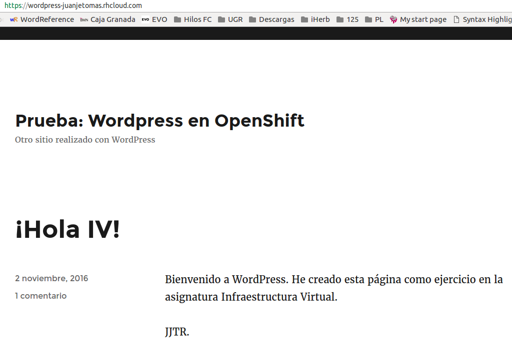
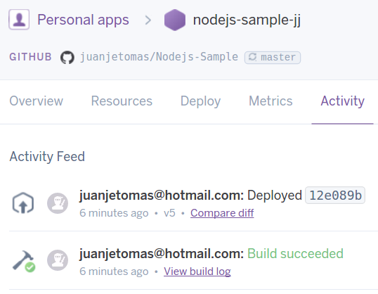

# Ejercicios del tema 3: Creando aplicaciones en la nube: Uso de PaaS
### Ejercicio 1
**Darse de alta en algún servicio PaaS tal como Heroku, Nodejitsu, BlueMix u OpenShift.**

En primer lugar me he registrado en Heroku:


A continuación me he registrado en Openshift, ya que se requiere para el ejercicio 2:


### Ejercicio 2
**Crear una aplicación en OpenShift y dentro de ella instalar WordPress.**

Accedemos a [esta página](https://openshift.redhat.com/app/console/applications) y clickamos en _create your first application now_:

_Nota: he usado el proceso de recuperación de contraseña de Openshift para poder acceder a este panel, ya que el disponible por defecto al registrarse en la web principal (con GitHub) no me ha funcionado idénticamente al tutorial usado_


Tras consultar [este tutorial de Wordpress en Openshift](https://github.com/openshift/wordpress-example), seleccionamos una aplicación PHP 5.4 y Wordpress y rellenamos tal y como se indica:


Tras iniciar la creación de la aplicación, obtenemos esto:


y podemos acceder a la inicialización del Wordpress visitando: http://wordpress-juanjetomas.rhcloud.com/




### Ejercicio 3
**Realizar una app en express (o el lenguaje y marco elegido) que incluya variables como en el caso anterior.**

Como primer paso, he añadido funciones REST (GET y PUT) a aplicación desarrollada con node.js + express ejercicios anteriores. Se encuentra en [este repositorio](https://github.com/juanjetomas/Nodejs-Sample).

Tras esto, si visitamos la dirección _/companies_ definida en el GET, obtenemos un JSON con la información almacenada hasta el momento:


A continuación, podemos hacer una inserción mediante:
```bash
curl -X PUT localhost:3000/addcomment/Pademobile/Excelente
```
Y obtenemos en terminal la lista actualizada de comentarios:


Si se vuelve a visitar la dirección _/companies_ se comprueba que se han reflejado los cambios.

### Ejercicio 4
**Crear pruebas para las diferentes rutas de la aplicación.**

Instalamos _supertest_ con:
```bash
npm install supertest --save-dev
```
Añadimos al final de _app.js_:
```javascript
module.exports = app;
```
Y añadimos los test que testean el código del ejercicio anterior en el archivo [test.js](https://github.com/juanjetomas/Nodejs-Sample/blob/master/tests/tests.js).

Comprobamos que los test se ejecutan correctamente:


### Ejercicio 5
**Instalar y echar a andar tu primera aplicación en Heroku.**

He seguido este tutorial: [Getting Started on Heroku with Node.js](https://devcenter.heroku.com/articles/getting-started-with-nodejs#introduction).

Instalamos el toolbelt de Heroku con:
```bash
wget -O- https://toolbelt.heroku.com/install-ubuntu.sh | sh
```
Y nos logueamos:


A continuación clonamos el repositorio de la App del tutorial:
```bash
git clone https://github.com/heroku/node-js-getting-started.git
```
Una vez en el directorio del proyecto, creamos la aplicación:


Y recibimos la confirmación de que todo está correcto:
```bash
remote: Verifying deploy... done.
To https://git.heroku.com/pruebanodejj.git
 * [new branch]      master -> master
```
Nos aseguramos de que al menos una instancia de la aplicación esta corriendo:
```bash
heroku ps:scale web=1
```
Con _heroku open_ nos abre la dirección https://pruebanodejj.herokuapp.com/ y comprobamos que la app de prueba está desplegada correctamente:


### Ejercicio 7
**Haz alguna modificación a tu aplicación en node.js para Heroku, sin olvidar añadir los tests para la nueva funcionalidad, y configura el despliegue automático a Heroku usando Snap CI o alguno de los otros servicios, como Codeship, mencionados en StackOverflow**

Creo una nueva aplicación en Heroku y accedo al [respositorio](https://github.com/juanjetomas/Nodejs-Sample) de mi aplicación de valoración de empresas mediante GitHub:


Una vez seleccionado el repositorio, seleccionamos que espere a pasar la integración contínua antes de desplegar, y activamos el despliegue automático:


Además, ya teníamos conectado Travis CI con el respositorio en ejercicios anteriores:


Tras esto, creamos el archivo _Procfile_ con el siguiente contenido:
```
web: node app.js
```

Y tras realizar un push al repositorio, los test se realizan correctamente en Travis:


Y automáticamente se realiza el despliegue en Heroku:



### Ejercicio 8
**Preparar la aplicación con la que se ha venido trabajando hasta este momento para ejecutarse en un PaaS, el que se haya elegido.**

Tras el correcto testeo en Travis la aplicación queda correctamente desplegada en Heroku y se puede acceder mediante esta dirección: https://nodejs-sample-jj.herokuapp.com/


Pudiendo realizar un PUT desde curl como hacíamos en local:


