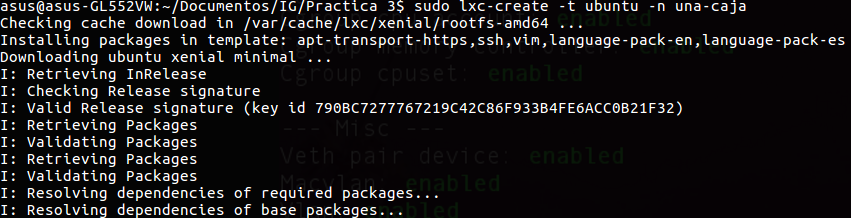
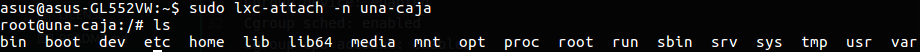
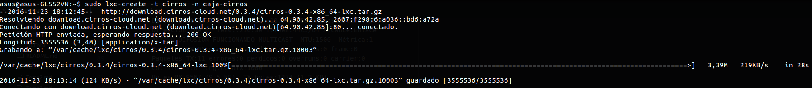
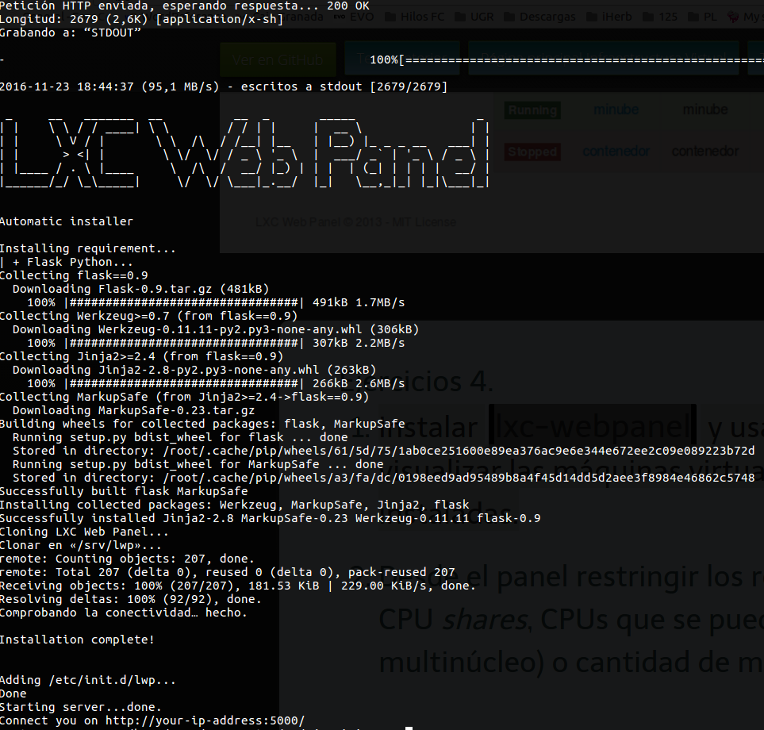
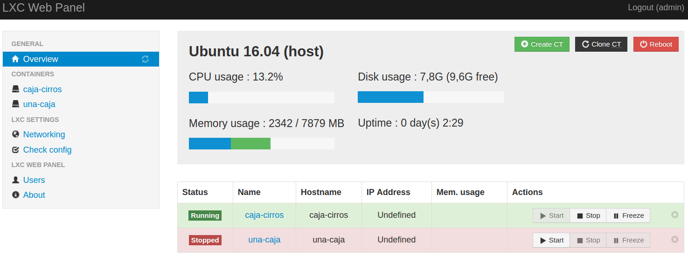
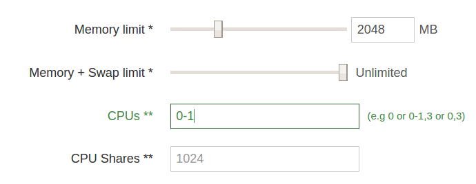

# Ejercicios del tema 4: Virtualización ligera usando contenedores
### Ejercicio 1
**Instala LXC en tu versión de Linux favorita. Normalmente la versión en desarrollo, disponible tanto en GitHub como en el sitio web está bastante más avanzada; para evitar problemas sobre todo con las herramientas que vamos a ver más adelante, conviene que te instales la última versión y si es posible una igual o mayor a la 1.0.**

Se instala mediante:
```bash
$ sudo apt-get install lxc
```
Y comprobamos que la versión es mayor a la 1.0:
```bash
$ lxc-start --version
2.0.5
```
También se comprueba la configuración:
```bash
asus@asus-GL552VW:~/Documentos/IG/Practica 3$ lxc-checkconfig
Kernel configuration not found at /proc/config.gz; searching...
Kernel configuration found at /boot/config-4.4.0-47-generic
--- Namespaces ---
Namespaces: enabled
Utsname namespace: enabled
Ipc namespace: enabled
Pid namespace: enabled
User namespace: enabled
Network namespace: enabled
Multiple /dev/pts instances: enabled

--- Control groups ---
Cgroup: enabled
Cgroup clone_children flag: enabled
Cgroup device: enabled
Cgroup sched: enabled
Cgroup cpu account: enabled
Cgroup memory controller: enabled
Cgroup cpuset: enabled

--- Misc ---
Veth pair device: enabled
Macvlan: enabled
Vlan: enabled
Bridges: enabled
Advanced netfilter: enabled
CONFIG_NF_NAT_IPV4: enabled
CONFIG_NF_NAT_IPV6: enabled
CONFIG_IP_NF_TARGET_MASQUERADE: enabled
CONFIG_IP6_NF_TARGET_MASQUERADE: enabled
CONFIG_NETFILTER_XT_TARGET_CHECKSUM: enabled
FUSE (for use with lxcfs): enabled

--- Checkpoint/Restore ---
checkpoint restore: enabled
CONFIG_FHANDLE: enabled
CONFIG_EVENTFD: enabled
CONFIG_EPOLL: enabled
CONFIG_UNIX_DIAG: enabled
CONFIG_INET_DIAG: enabled
CONFIG_PACKET_DIAG: enabled
CONFIG_NETLINK_DIAG: enabled
File capabilities: enabled

Note : Before booting a new kernel, you can check its configuration
usage : CONFIG=/path/to/config /usr/bin/lxc-checkconfig
```

### Ejercicio 2
**Comprobar qué interfaces puente se han creado y explicarlos.**

En primer lugar se crea la caja de ubuntu:



A continuación, se arranca:
```bash
sudo lxc-start -n una-caja
```

Una vez terminado el proceso, accedemos a ella:



Aunque es mejor acceder a la consola mediante este comando, facilitándose así la salida de la misma:
```bash
sudo lxc-console -n una-caja
```

Podemos observar las interfaces puente de la caja:
```bash
root@una-caja:/# ifconfig
eth0      Link encap:Ethernet  direcciónHW 00:16:3e:e8:44:c5  
          Direc. inet:10.0.3.184  Difus.:10.0.3.255  Másc:255.255.255.0
          Dirección inet6: fe80::216:3eff:fee8:44c5/64 Alcance:Enlace
          ACTIVO DIFUSIÓN FUNCIONANDO MULTICAST  MTU:1500  Métrica:1
          Paquetes RX:65 errores:0 perdidos:0 overruns:0 frame:0
          Paquetes TX:11 errores:0 perdidos:0 overruns:0 carrier:0
          colisiones:0 long.colaTX:1000
          Bytes RX:9567 (9.5 KB)  TX bytes:1374 (1.3 KB)

lo        Link encap:Bucle local  
          Direc. inet:127.0.0.1  Másc:255.0.0.0
          Dirección inet6: ::1/128 Alcance:Anfitrión
          ACTIVO BUCLE FUNCIONANDO  MTU:65536  Métrica:1
          Paquetes RX:0 errores:0 perdidos:0 overruns:0 frame:0
          Paquetes TX:0 errores:0 perdidos:0 overruns:0 carrier:0
          colisiones:0 long.colaTX:1
          Bytes RX:0 (0.0 B)  TX bytes:0 (0.0 B)
```
En el sistema anfitrión, comprobamos que se ha creado una interfaz para la comunicación con la caja:
```bash
asus@asus-GL552VW:~$ ifconfig
lo        Link encap:Bucle local  
          Direc. inet:127.0.0.1  Másc:255.0.0.0
          Dirección inet6: ::1/128 Alcance:Anfitrión
          ACTIVO BUCLE FUNCIONANDO  MTU:65536  Métrica:1
          Paquetes RX:6450 errores:0 perdidos:0 overruns:0 frame:0
          Paquetes TX:6450 errores:0 perdidos:0 overruns:0 carrier:0
          colisiones:0 long.colaTX:1
          Bytes RX:1295029 (1.2 MB)  TX bytes:1295029 (1.2 MB)
```

Tras esto, detenemos a la caja:
```bash
sudo lxc-stop -n una-caja
```

### Ejercicio 3
**Crear y ejecutar un contenedor basado en Debian.**

Mi distribución es Ubuntu y el contenedor que he instaldo en el ejercicio anterior es Ubuntu, por lo que he instaldo un contenedor basado en mi misma distribución (Debian)

**Crear y ejecutar un contenedor basado en otra distribución, tal como Fedora. Nota En general, crear un contenedor basado en tu distribución y otro basado en otra que no sea la tuya. Fedora, al parecer, tiene problemas si estás en Ubuntu 13.04 o superior, así que en tal caso usa cualquier otra distro.**

Mi intentción inicial fue instalar Centos, pero como he tenido problemas de dependencias, finalmente he instalado Cirros, que viene como template por defecto:



### Ejercicio 4
**Instalar lxc-webpanel y usarlo para arrancar, parar y visualizar las máquinas virtuales que se tengan instaladas.**

He descargado el script de instalación de su web (_wget https://lxc-webpanel.github.io/tools/install.sh -O - | bash_), no sin antes haber utilizado _sudo su_:



Nos logueamos usando _admin_ como user y password, y en http://localhost:5000/ ya tenemos acceso:



**Desde el panel restringir los recursos que pueden usar: CPU shares, CPUs que se pueden usar (en sistemas multinúcleo) o cantidad de memoria.**

He restringido los recursos del container de Cirros a 2 GB de RAM y como máximo 1 núcleo del procesador.



### Ejercicio 5
**Comparar las prestaciones de un servidor web en una jaula y el mismo servidor en un contenedor. Usar nginx.**

Usaré el contenedor (caja) de Ubuntu creado en los ejercicios anteriores. Como jaula, usaré [debootstrap](https://wiki.debian.org/es/debootstrap). Se instala mediante:
```bash
sudo apt-get install debootstrap
```
Aunque en mi caso no ha sido necesario ya que estaba previamente instalado en mi sistema. A continuación, creamos la jaula:
```bash
$ sudo debootstrap --arch=amd64 xenial /home/jaulas/xenial/ http://archive.ubuntu.com/ubuntu
I: Retrieving InRelease
I: Checking Release signature
I: Valid Release signature (key id 790BC7277767219C42C86F933B4FE6ACC0B21F32)
I: Retrieving Packages
I: Validating Packages
I: Resolving dependencies of required packages...
I: Resolving dependencies of base packages...
I: Checking component main on http://archive.ubuntu.com/ubuntu...
I: Retrieving adduser 3.113+nmu3ubuntu4
I: Validating adduser 3.113+nmu3ubuntu4
I: Retrieving apt 1.2.10ubuntu1
I: Validating apt 1.2.10ubuntu1
I: Retrieving apt-utils 1.2.10ubuntu1
I: Validating apt-utils 1.2.10ubuntu1
I: Retrieving base-files 9.4ubuntu4
I: Validating base-files 9.4ubuntu4
I: Retrieving base-passwd 3.5.39
I: Validating base-passwd 3.5.39

[...]
```

Una vez instalada la jaula, accedemos a ella:
```bash
$ sudo chroot /home/jaulas/xenial/
root@asus-GL552VW:/#
```
Configuramos el proc:
```bash
mount -t proc proc /proc
```
Y el idioma:
```bash
apt-get install language-pack-es
```
He instaldo Nginx siguiendo [este tutorial](https://www.nginx.com/resources/wiki/start/topics/tutorials/install/).
Finalmente, lo lanzo con:
```bash
service nginx start
```
Desde fuera de la jaula, compruebo que está funcionado mediante:
```bash
$ curl http://localhost:80/
<!DOCTYPE html>
<html>
<head>
<title>Welcome to nginx!</title>

[...]
```

En el contenedor, accedo al archivo _/etc/nginx/sites-enabled/default_ y especifico el puerto 81 para diferenciarlo del nginx de la jaula:
```bash
server {
        listen 81 default_server;
        listen [::]:81 default_server;

        [...]
      }
```

La ejecución del Apache Benchmark en la caja da:
```bash_
$ ab -n 1000 -c 5 http://127.0.0.1:80/
This is ApacheBench, Version 2.3 <$Revision: 1706008 $>
Copyright 1996 Adam Twiss, Zeus Technology Ltd, http://www.zeustech.net/
Licensed to The Apache Software Foundation, http://www.apache.org/

Benchmarking 127.0.0.1 (be patient)
Completed 100 requests
Completed 200 requests
Completed 300 requests
Completed 400 requests
Completed 500 requests
Completed 600 requests
Completed 700 requests
Completed 800 requests
Completed 900 requests
Completed 1000 requests
Finished 1000 requests


Server Software:        nginx/1.10.0
Server Hostname:        127.0.0.1
Server Port:            80

Document Path:          /
Document Length:        612 bytes

Concurrency Level:      5
Time taken for tests:   0.044 seconds
Complete requests:      1000
Failed requests:        0
Total transferred:      854000 bytes
HTML transferred:       612000 bytes
Requests per second:    22803.46 [#/sec] (mean)
Time per request:       0.219 [ms] (mean)
Time per request:       0.044 [ms] (mean, across all concurrent requests)
Transfer rate:          19017.73 [Kbytes/sec] received

Connection Times (ms)
              min  mean[+/-sd] median   max
Connect:        0    0   0.0      0       0
Processing:     0    0   0.0      0       0
Waiting:        0    0   0.0      0       0
Total:          0    0   0.0      0       0

Percentage of the requests served within a certain time (ms)
  50%      0
  66%      0
  75%      0
  80%      0
  90%      0
  95%      0
  98%      0
  99%      0
 100%      0 (longest request)
```

Y en la jaula:
```bash
This is ApacheBench, Version 2.3 <$Revision: 1706008 $>
Copyright 1996 Adam Twiss, Zeus Technology Ltd, http://www.zeustech.net/
Licensed to The Apache Software Foundation, http://www.apache.org/

Benchmarking 127.0.0.1 (be patient)
Completed 100 requests
Completed 200 requests
Completed 300 requests
Completed 400 requests
Completed 500 requests
Completed 600 requests
Completed 700 requests
Completed 800 requests
Completed 900 requests
Completed 1000 requests
Finished 1000 requests


Server Software:        nginx/1.9.15
Server Hostname:        127.0.0.1
Server Port:            80

Document Path:          /
Document Length:        612 bytes

Concurrency Level:      5
Time taken for tests:   0.036 seconds
Complete requests:      1000
Failed requests:        0
Total transferred:      854000 bytes
HTML transferred:       612000 bytes
Requests per second:    27409.28 [#/sec] (mean)
Time per request:       0.182 [ms] (mean)
Time per request:       0.036 [ms] (mean, across all concurrent requests)
Transfer rate:          22858.91 [Kbytes/sec] received

Connection Times (ms)
              min  mean[+/-sd] median   max
Connect:        0    0   0.0      0       0
Processing:     0    0   0.0      0       1
Waiting:        0    0   0.0      0       1
Total:          0    0   0.0      0       1

Percentage of the requests served within a certain time (ms)
  50%      0
  66%      0
  75%      0
  80%      0
  90%      0
  95%      0
  98%      0
  99%      0
 100%      1 (longest request)
```
Si comparamos el valor _Requests per second_ la jaula da un mayor rendimiento.

### Ejercicio 6
**Instalar docker**

Instalado mediante:
```bash
sudo apt-get install docker.io
```

### Ejercicio 7
**Instalar a partir de docker una imagen alternativa de Ubuntu y alguna adicional, por ejemplo de CentOS.**

Comprobamos que docker está corriendo con:
```bash
sudo service docker status
```
Y si no lo está haciendo lo iniciamos con:
```bash
sudo service docker start
```
Instalamos Ubuntu:
```bash
$ sudo docker pull ubuntu
Using default tag: latest
latest: Pulling from library/ubuntu
aed15891ba52: Pull complete
773ae8583d14: Pull complete
d1d48771f782: Pull complete
cd3d6cd6c0cf: Pull complete
8ff6f8a9120c: Pull complete
Digest: sha256:35bc48a1ca97c3971611dc4662d08d131869daa692acb281c7e9e052924e38b1
Status: Downloaded newer image for ubuntu:latest
```
Instalamos CentOS:
```bash
$ sudo docker pull ubuntu
Using default tag: latest
latest: Pulling from library/ubuntu
aed15891ba52: Pull complete
773ae8583d14: Pull complete
d1d48771f782: Pull complete
cd3d6cd6c0cf: Pull complete
8ff6f8a9120c: Pull complete
Digest: sha256:35bc48a1ca97c3971611dc4662d08d131869daa692acb281c7e9e052924e38b1
Status: Downloaded newer image for ubuntu:latest
asus@asus-GL552VW:~/Documentos/IV/EjerciciosIV$ sudo docker pull centos
Using default tag: latest
```

**Buscar e instalar una imagen que incluya MongoDB.**
```bash
$ sudo docker pull mongo
Using default tag: latest
latest: Pulling from library/mongo
386a066cd84a: Pull complete
524267bc200a: Pull complete
476d61c7c43a: Pull complete
0750d0e28b90: Pull complete
4bedd83d0855: Pull complete
162b67684652: Pull complete
46f53b7d829e: Pull complete
cef8f3d7f866: Pull complete
2272eba3cacc: Pull complete
Digest: sha256:5c0b6ec4ed120b591ba625806d4b4e59379e0e8ecb0591e41b3f16cfdf0015a2
Status: Downloaded newer image for mongo:latest
```

Y comprobamos las imágenes instaladas:
```bash
$ sudo docker images
REPOSITORY          TAG                 IMAGE ID            CREATED             SIZE
mongo               latest              c5185a594064        4 days ago          342.7 MB
ubuntu              latest              e4415b714b62        9 days ago          128.1 MB
centos              latest              0584b3d2cf6d        3 weeks ago         196.5 MB
hello-world         latest              c54a2cc56cbb        4 months ago        1.848 kB
```

### Ejercicio 8
**Crear un usuario propio e instalar nginx en el contenedor creado de esta forma.**

Ejecutamos un shell de la imagen de Ubuntu:
```bash
asus@asus-GL552VW:~/Documentos/IV/EjerciciosIV$ sudo docker run -i -t ubuntu /bin/bash
root@763825b26902:/#
```

Añado un nuevo usuario, establezco su contraseña, lo añado al grupo sudo, instalo el paquete sudo y me logueo con él:
```bash
root@763825b26902:/# useradd -d /home/nuevouser -m nuevouser
root@763825b26902:/# passwd nuevouser
Enter new UNIX password:
Retype new UNIX password:
passwd: password updated successfully
root@763825b26902:/# adduser nuevouser sudo
Adding user 'nuevouser' to group 'sudo' ...
Adding user nuevouser to group sudo
Done.
root@763825b26902:/# apt-get install sudo
Reading package lists... Done
Building dependency tree       
Reading state information... Done
The following NEW packages will be installed:
  sudo
0 upgraded, 1 newly installed, 0 to remove and 3 not upgraded.
Need to get 389 kB of archives.
After this operation, 1618 kB of additional disk space will be used.
Get:1 http://archive.ubuntu.com/ubuntu xenial-updates/main amd64 sudo amd64 1.8.16-0ubuntu1.2 [389 kB]
Fetched 389 kB in 0s (868 kB/s)
debconf: delaying package configuration, since apt-utils is not installed
Selecting previously unselected package sudo.
(Reading database ... 7259 files and directories currently installed.)
Preparing to unpack .../sudo_1.8.16-0ubuntu1.2_amd64.deb ...
Unpacking sudo (1.8.16-0ubuntu1.2) ...
Setting up sudo (1.8.16-0ubuntu1.2) ...
root@763825b26902:/# login nuevouser
Password:
Welcome to Ubuntu 16.04.1 LTS (GNU/Linux 4.4.0-47-generic x86_64)

 * Documentation:  https://help.ubuntu.com
 * Management:     https://landscape.canonical.com
 * Support:        https://ubuntu.com/advantage

The programs included with the Ubuntu system are free software;
the exact distribution terms for each program are described in the
individual files in /usr/share/doc/*/copyright.

Ubuntu comes with ABSOLUTELY NO WARRANTY, to the extent permitted by
applicable law.
```
Instalo Nginx
```bash
$ sudo apt-get install nginx
```
Lo lanzo y compruebo que está funcionado:
```bash
nuevouser@763825b26902:~$ sudo service nginx start
 * Starting nginx
 nginx         [ OK ] 
nuevouser@763825b26902:~$ sudo service nginx status
 * nginx is running
```
