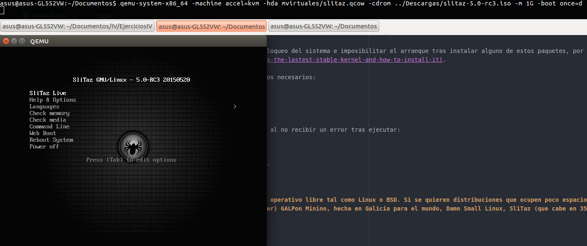
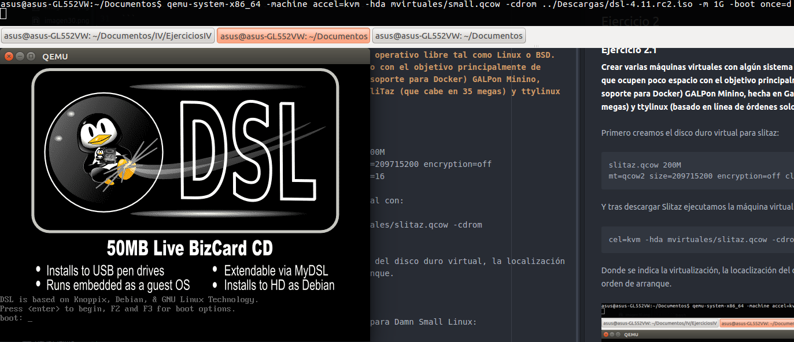
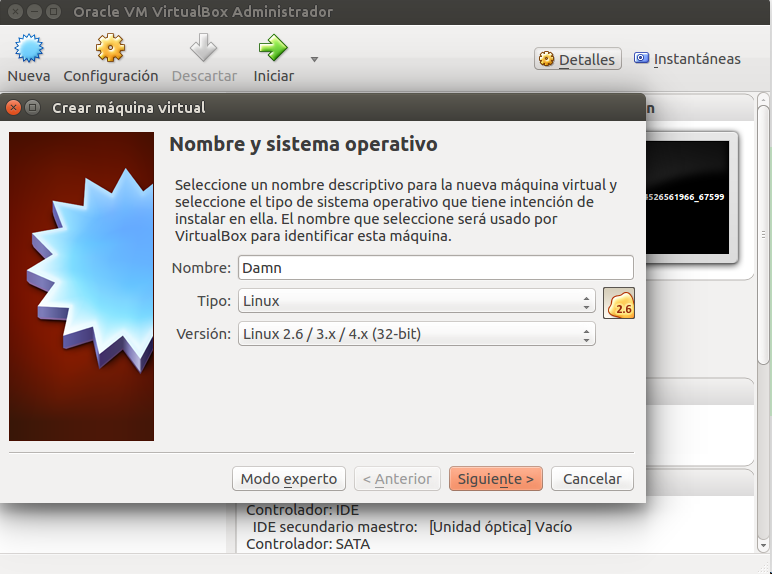
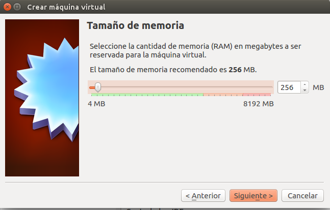
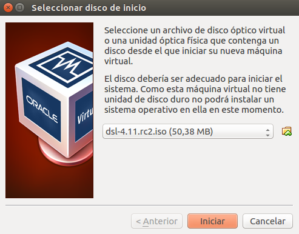
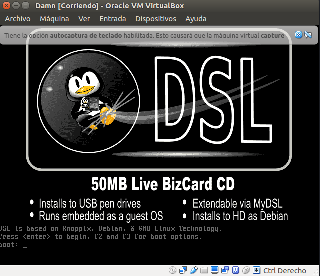
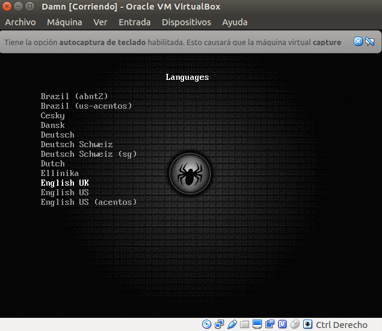
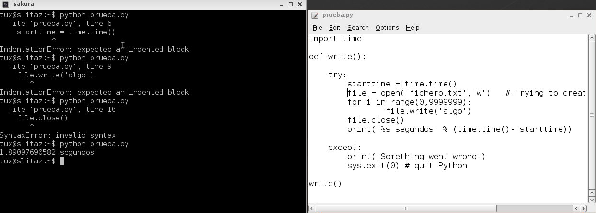

# Ejercicios del tema 5: Virtualización completa: uso de máquinas virtuales
### Ejercicio 1
**Instalar los paquetes necesarios para usar KVM. Se pueden seguir estas instrucciones. Ya lo hicimos en el primer tema, pero volver a comprobar si nuestro sistema está preparado para ejecutarlo o hay que conformarse con la paravirtualización.**

Siguiendo [estas instrucciones](https://help.ubuntu.com/community/KVM/Installation) comprobamos que KVM está instalado y se puede usar la virtualización:

```bash
$ kvm-ok
INFO: /dev/kvm exists
KVM acceleration can be used
```
A continuación, siguiendo la [wiki de KMV](https://wiki.debian.org/KVM#Installation) instalo el paquete _qemu-kvm_ y otros necesarios:

```bash
sudo apt-get install kvm qemu-kvm libvirt-bin virtinst
```

**Atención**: un kernel antiguo puede provocar el bloqueo del sistema e imposibilitar el arranque tras instalar alguno de estos paquetes, por lo que se recomiendo actualizarlo siguiendo [estos pasos](http://askubuntu.com/questions/777627/what-is-the-lastest-stable-kernel-and-how-to-install-it).

A continuación, añadimos nuestro usuario a los grupos necesarios:
```bash
sudo adduser asus libvirtd
sudo adduser asus kvm
```

Y comprobamos que todo está correctamente instalado al no recibir un error tras ejecutar:
```bash
virsh list --all
 Id    Nombre                         Estado
----------------------------------------------------
```
### Ejercicio 2
#### Ejercicio 2.1
**Crear varias máquinas virtuales con algún sistema operativo libre tal como Linux o BSD. Si se quieren distribuciones que ocupen poco espacio con el objetivo principalmente de hacer pruebas se puede usar CoreOS (que sirve como soporte para Docker) GALPon Minino, hecha en Galicia para el mundo, Damn Small Linux, SliTaz (que cabe en 35 megas) y ttylinux (basado en línea de órdenes solo).**

Primero creamos el disco duro virtual para slitaz:
```bash
$ qemu-img create -f qcow2 mvirtuales/slitaz.qcow 200M
Formatting 'mvirtuales/slitaz.qcow', fmt=qcow2 size=209715200 encryption=off cluster_size=65536 lazy_refcounts=off refcount_bits=16
```
Y tras descargar Slitaz ejecutamos la máquina virtual con:
```bash
$ qemu-system-x86_64 -machine accel=kvm -hda mvirtuales/slitaz.qcow -cdrom ../Descargas/slitaz-5.0-rc3.iso -m 1G -boot once=d
```
Donde se indica la virtualización, la locaclización del disco duro virtual, la localización del archivo iso, la RAM asignada y el orden de arranque.



De la misma forma, creamos otro disco duro virtual para Damn Small Linux:
```bash
$ qemu-img create -f qcow2 mvirtuales/small.qcow 200M
Formatting 'mvirtuales/small.qcow', fmt=qcow2 size=209715200 encryption=off cluster_size=65536 lazy_refcounts=off refcount_bits=16
```
Y ejecutamos:


#### Ejercicio 2.2
**Hacer un ejercicio equivalente usando otro hipervisor como Xen, VirtualBox o Parallels.**

Desde Virtualbox, hacemos click en _nueva_ y rellenamos los datos tal y como se muestra:



Se asigna la ram:



Si el sistema muestra que el driver de virtualbox no está funcionando correctamente, hay un sinfín de posiblidades, pero en mi caso me funcionó lo siguiente:
* Desisntalar dkms
* Desinstalar Virtualbox
* Instalar ambos siguiendo [esta guía](https://www.virtualbox.org/wiki/Linux_Downloads)

Se selecciona el archivo .iso:



E inicia la máquina virtual:



Siguiendo los mismos pasos arrancamos Slitaz:



### Ejercicio 3
**Crear un benchmark de velocidad de entrada salida y comprobar la diferencia entre usar paravirtualización y arrancar la máquina virtual simplemente con qemu-system-x86_64 -hda /media/Backup/Isos/discovirtual.img**

Instalo Slitaz y lo abro de la manera habitual:
```bash
qemu-system-x86_64 -machine accel=kvm -hda Documentos/mvirtuales/slitaz.qcow -m 1G
```
Y ejecuto un pequeño progama que he creado que escribe en disco (donde se quiere comprobar la mejora), arrojando este tiempo de ejecución:


