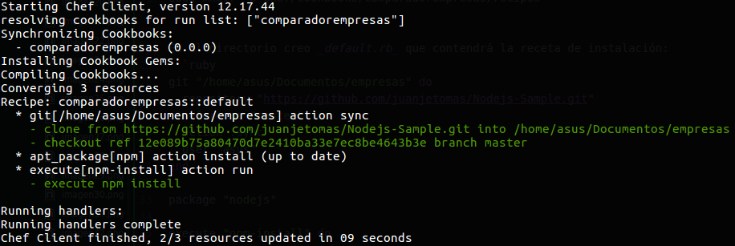
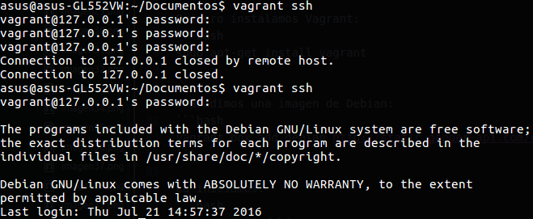

# Ejercicios del tema 5: Gestión de infraestructuras virtuales
### Ejercicio 1
**Instalar chef en la máquina virtual que vayamos a usar**

Instalamos Chef como indica [la documentación](http://gettingstartedwithchef.com/first-steps-with-chef.html) con:
```bash
curl -L https://www.opscode.com/chef/install.sh | sudo bash
```
Comprobamos que la instalación es correcta:
```bash
$ chef-solo -v
Chef: 12.17.44
```

### Ejercicio 2
**Crear una receta para instalar la aplicación que se viene creando en la asignatura en alguna máquina virtual o servidor en la nube.**

Para probar Chef-solo de una manera rápida voy a realizar la instalación la aplicación que he desarrollado para pruebas en la asignatura en Nodejs. En primer lugar creo el siguiente directorio desde /home:

```bash
sudo mkdir -p chef/cookbooks/comparadorempresas/recipes
```

En el directorio creo _default.rb_ que contendrá la receta de instalación:
```ruby
git "/home/asus/Documentos/empresas" do
  repository "https://github.com/juanjetomas/Nodejs-Sample.git"
  reference "master"
  action :sync
  user "asus"
end

package "nodejs"

execute "npm-install" do
  cwd "home/asus/Documentos/empresas"
  command "npm install"
  user "asus"
  group "sudo"
  action :run
end
```

Clona el respositorio en la carpeta _empresas_, se instala _nodejs_ y se instalan los requisitos incluidos en el _package.json_.

En la carpeta _chef_ creo el documento _node.json_ donde se enumeran las recetas, en este caso una sola:

```json
{
	"run_list": [ "recipe[comparadorempresas]" ]
}
```

A continuación he creado el archivo _solo.rb_ en mi directorio _HOME_ con el siguiente contenido:
```ruby
file_cache_path "/home/chef"
cookbook_path "/home/chef/cookbooks"
json_attribs "/home/chef/node.json"
```

Lanzamos la receta con:
```bash
sudo chef-solo -c solo.rb
```



Y ya estaría instalado todo lo necesario para ejecutar la aplicación:
```bash
node app.js
```

### Ejercicio 4
**Instalar una máquina virtual Debian usando Vagrant y conectar con ella.**

Primero instalamos Vagrant:
```bash
sudo apt-get install vagrant
```

Y añadimos una imagen de Debian:
```bash
vagrant box add debian http://static.gender-api.com/debian-8-jessie-rc2-x64-slim.box
```

La iniciamos:
```bash
vagrant init debian
```

Y se crea un archivo _Vagrantfile_.

Instalamos Virtualbox:

```bash
sudo apt-get install virtualbox virtualbox-dkms
```

Levantamos la máquina con:
```bash
vagrant up
```

Y podemos conectarnos por ssh (introduciendo _vagrant_ como contraseña):



### Ejercicio 5
**Crear un script para provisionar `nginx` o cualquier otro servidor web que pueda ser útil para alguna otra práctica**

Como tenía un problema con la autentificación para el SSH en primer lugar he añadido:
```bash
config.ssh.insert_key = false
```
al _vagrantfile_ tal y como se comenta en este [issue en Github](https://github.com/mitchellh/vagrant/issues/7610). Además, he añadido lo necesario para actualizar las fuentes de Ubuntu, instalar y lanzar Nginx añadiendo al _Vagrantfile_ esto:
```bash
config.vm.provision "shell", inline: "sudo apt-get update && sudo apt-get install -y nginx && sudo service nginx start"
```
Provisionamos la máquina con:
```bash
vagrant sudo provisionar
```
Y tras acceder por SSH a ella, comprobamos que Nginx está corriendo:
```bash
vagrant@vagrant:~$ sudo service nginx status
● nginx.service - A high performance web server and a reverse proxy server
   Loaded: loaded (/lib/systemd/system/nginx.service; enabled)
   Active: active (running) since Sun 2017-01-15 11:33:23 CST; 37s ago
 Main PID: 1486 (nginx)
   CGroup: /system.slice/nginx.service
           ├─1486 nginx: master process /usr/sbin/nginx -g daemon on; master_process on;
           ├─1487 nginx: worker process
           ├─1488 nginx: worker process
           ├─1489 nginx: worker process
           └─1490 nginx: worker process
```

### Ejercicio 6
**Configurar tu máquina virtual usando vagrant con el provisionador chef.**

He añadido lo siguiente al archivo _vagrantfile_:
```ruby
config.vm.provision "chef_solo" do |chef|
  chef.cookbooks_path = "/home/chef/cookbooks"
  chef.add_recipe "comparadorempresas"
end
```
Que indica en qué carpeta del equipo que orquesta se encuentran las recetas. Además, la receta para instalar la aplicación de node-js la he modificado así:
```ruby
package "git"

directory '/home/vagrant/empresas' do
  owner 'vagrant'
  group 'vagrant'
  recursive true
end

git "/home/vagrant/empresas" do
  repository "https://github.com/juanjetomas/Nodejs-Sample.git"
  reference "master"
  action :sync
  user "vagrant"
end

package "npm"

execute "npm-install" do
  cwd "/home/vagrant/empresas"
  command "npm install"
  user "vagrant"
  group "vagrant"
  action :run
end
```
Incluyo el paquete git, creo una carpeta dedicada, clono el repositorio, instalo npm e instalo dependencias. Como el funcionamiento de este provisionamiento ha sido progresivo, he destruido la máquina virtual y la he creado de nuevo para así ver como se lleva a cabo el proceso completo:
```bash
asus@asus-GL552VW:~/Documentos$ vagrant up
Bringing machine 'default' up with 'virtualbox' provider...
==> default: Importing base box 'debian'...
==> default: Matching MAC address for NAT networking...
==> default: Setting the name of the VM: Documentos_default_1484526561966_67599
==> default: Auto-generating node name for Chef...
==> default: Clearing any previously set network interfaces...
==> default: Preparing network interfaces based on configuration...
    default: Adapter 1: nat
==> default: Forwarding ports...
    default: 22 (guest) => 2222 (host) (adapter 1)
==> default: Booting VM...
==> default: Waiting for machine to boot. This may take a few minutes...
    default: SSH address: 127.0.0.1:2222
    default: SSH username: vagrant
    default: SSH auth method: private key
==> default: Machine booted and ready!
==> default: Checking for guest additions in VM...
==> default: Mounting shared folders...
    default: /vagrant => /home/asus/Documentos
    default: /tmp/vagrant-chef/1406277d13ae5729ceaec452acc3fec4/cookbooks => /home/chef/cookbooks
==> default: Running provisioner: chef_solo...
    default: Installing Chef (latest)...
==> default: Generating chef JSON and uploading...
==> default: Running chef-solo...
==> default: stdin: is not a tty
==> default: [2017-01-15T18:31:00-06:00] INFO: Started chef-zero at chefzero://localhost:8889 with repository at /tmp/vagrant-chef/1406277d13ae5729ceaec452acc3fec4
==> default:   One version per cookbook
==> default:
==> default: [2017-01-15T18:31:00-06:00] INFO: Forking chef instance to converge...
==> default: Starting Chef Client, version 12.17.44
==> default: [2017-01-15T18:31:00-06:00] INFO: *** Chef 12.17.44 ***
==> default: [2017-01-15T18:31:00-06:00] INFO: Platform: x86_64-linux
==> default: [2017-01-15T18:31:00-06:00] INFO: Chef-client pid: 1352
==> default: [2017-01-15T18:31:02-06:00] INFO: HTTP Request Returned 404 Not Found: Object not found: chefzero://localhost:8889/nodes/vagrant-0e57c71d
==> default: [2017-01-15T18:31:02-06:00] INFO: Setting the run_list to ["recipe[comparadorempresas]"] from CLI options
==> default: [2017-01-15T18:31:02-06:00] INFO: Run List is [recipe[comparadorempresas]]
==> default: [2017-01-15T18:31:02-06:00] INFO: Run List expands to [comparadorempresas]
==> default: [2017-01-15T18:31:02-06:00] INFO: Starting Chef Run for vagrant-0e57c71d
==> default: [2017-01-15T18:31:02-06:00] INFO: Running start handlers
==> default: [2017-01-15T18:31:02-06:00] INFO: Start handlers complete.
==> default: [2017-01-15T18:31:02-06:00] INFO: HTTP Request Returned 404 Not Found: Object not found:
==> default: resolving cookbooks for run list: ["comparadorempresas"]
==> default: [2017-01-15T18:31:02-06:00] INFO: Loading cookbooks [comparadorempresas@0.0.0]
==> default: Synchronizing Cookbooks:
==> default: [2017-01-15T18:31:02-06:00] INFO: Storing updated cookbooks/comparadorempresas/recipes/default.rb in the cache.
==> default:   
==> default: - comparadorempresas (0.0.0)
==> default: Installing Cookbook Gems:
==> default: Compiling Cookbooks...
==> default: Converging 5 resources
==> default: Recipe: comparadorempresas::default
==> default:   
==> default: * apt_package[git] action install
==> default: [2017-01-15T18:31:11-06:00] INFO: apt_package[git] installed git at 1:2.1.4-2.1+deb8u2
==> default:
==> default:     - install version 1:2.1.4-2.1+deb8u2 of package git
==> default:   * directory[/home/vagrant/empresas] action create
==> default: [2017-01-15T18:31:11-06:00] INFO: directory[/home/vagrant/empresas] created directory /home/vagrant/empresas
==> default:     
==> default: - create new directory /home/vagrant/empresas
==> default: [2017-01-15T18:31:11-06:00] INFO: directory[/home/vagrant/empresas] owner changed to 1000
==> default: [2017-01-15T18:31:11-06:00] INFO: directory[/home/vagrant/empresas] group changed to 1000
==> default:     
==> default: - change owner from '' to 'vagrant'
==> default:     
==> default: - change group from '' to 'vagrant'
==> default:
==> default:
==> default:   
==> default: * git[/home/vagrant/empresas] action sync
==> default: [2017-01-15T18:31:12-06:00] INFO: git[/home/vagrant/empresas] cloning repo https://github.com/juanjetomas/Nodejs-Sample.git to /home/vagrant/empresas
==> default:
==> default:     - clone from https://github.com/juanjetomas/Nodejs-Sample.git into /home/vagrant/empresas
==> default: [2017-01-15T18:31:16-06:00] INFO: git[/home/vagrant/empresas] checked out branch: master onto: deploy reference: 12e089b75a80470d7e2410ba33e7ec8be4643b3e
==> default:
==> default:     - checkout ref 12e089b75a80470d7e2410ba33e7ec8be4643b3e branch master
==> default:   * apt_package[npm] action install
==> default: [2017-01-15T18:32:10-06:00] INFO: apt_package[npm] installed npm at 1.4.21+ds-2
==> default:
==> default:     - install version 1.4.21+ds-2 of package npm
==> default:   * execute[npm-install] action run
==> default:
==> default:     [execute] npm
==> default:  
==> default: WARN
==> default:  
==> default: prefer global
==> default:  coffee-script@1.10.0 should be installed with -g
==> default:               npm
==> default:  
==> default: WARN
==> default:  
==> default: prefer global
==> default:  marked@0.3.6 should be installed with -g
==> default:               npm
==> default:  
==> default: WARN
==> default:  
==> default: unmet dependency
==> default:  /home/vagrant/empresas/node_modules/jade requires commander@'0.6.1' but will load
==> default:               npm
==> default:  
==> default: WARN
==> default:  
==> default: unmet dependency
==> default:  /home/vagrant/empresas/node_modules/commander,
==> default:               npm
==> default:  
==> default: WARN
==> default:  
==> default: unmet dependency
==> default:  which is version 2.9.0
==> default: [2017-01-15T18:32:11-06:00] INFO: execute[npm-install] ran successfully
==> default:     - execute npm install
==> default:
==> default: [2017-01-15T18:32:11-06:00] INFO: Chef Run complete in 69.545656784 seconds
==> default:
==> default: Running handlers:
==> default: [2017-01-15T18:32:11-06:00] INFO: Running report handlers
==> default: Running handlers complete
==> default:
==> default: [2017-01-15T18:32:11-06:00] INFO: Report handlers complete
==> default: Chef Client finished, 5/5 resources updated in 01 minutes 11 seconds

```
